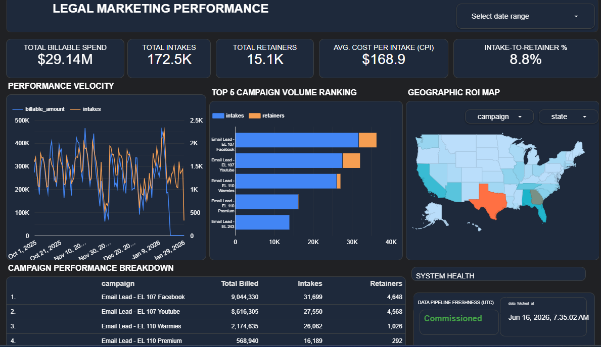

# Cloud-Automated Legal Marketing Performance Pipeline

An end-to-end cloud data engineering and business intelligence solution designed to eliminate manual data extraction workflows for high-growth legal marketing agencies. This project migrates fragmented, static operational data into a centralized cloud data warehouse, automates metric transformations using SQL, and delivers an executive-ready performance dashboard.

## 📊 The Problem
High-growth digital marketing agencies frequently face scaling bottlenecks due to CRM incompatibilities and fragmented ad-channel tracking. In this scenario, maintaining an executive-ready performance dashboard previously required extensive manual CSV exports and repetitive spreadsheet manipulation. This operational friction limited real-time visibility and introduced significant risks of data latency and human error.

## 🛠️ Tech Stack & Architecture
* **Data Ingestion:** Automated cloud routing from operational source data streams into Google Cloud.
* **Data Warehousing:** Centralized storage using **Google BigQuery** as the core cloud data warehouse.
* **Data Transformation Layer:** Highly optimized SQL scripts and views engineered to handle automated data cleaning, schema mapping, and complex calculated fields.
* **Business Intelligence & Analytics:** High-impact, interactive interface delivery via **Looker Studio**.

---

## 🏗️ Pipeline Architecture & Implementation Details

### 1. Cloud-Hosted SQL Transformation Layer
To ensure zero lag and maintain strict mathematical accuracy across millions of rows of data, all heavy transformations are handled natively inside the cloud warehouse using structured views. This script cleans raw strings, formats operational metrics, and implements fail-safe calculations (such as preventing division-by-zero errors during conversion tracking).

### 2. Bypassing BI Layout & Calculation Quirks
A common vulnerability in reporting tools like Looker Studio is metric corruption during executive exports (e.g., summary calculations dropping to 0% during Print-to-PDF procedures). 

This pipeline resolves this by overriding standard interface metrics and implementing dynamic, custom-aggregated calculations directly within the BI modeling layer:
SUM(retainers) / SUM(intakes)

Configuring the data logic at this layer guarantees that calculated fields remain fully accurate, responsive to date-range filters, and visually stable across all viewing and reporting formats.

### 3. Automated Infrastructure Monitoring
To maintain strict data governance and transparency, a dedicated **System Health Ledger** is engineered directly into the pipeline. By extracting the maximum metadata timestamp from the cloud warehouse ingestion cycle, the interface dynamically displays infrastructure freshness down to the exact second. This eliminates tracking uncertainty and ensures stakeholders are always analyzing live data.

---

## 📈 Key Metrics Visualized
* **Performance Velocity:** A synchronized time-series analysis mapping total billable spend against intake volumes over time to track operational momentum.
* **Campaign Volume Ranking:** A clear corporate horizontal breakdown identifying top-performing lead acquisition funnels.
* **Geographic ROI Map:** Spatial analysis layer tracking geographic intake volume density to optimize localized media buying spend.
* **Financial & Conversion Scorecards:** High-level executive counters tracking Total Billable Spend, Total Intakes, Total Retainers, Average Cost Per Intake (CPI), and the core Intake-to-Retainer conversion percentage.

---

## 💼 Business Impact
* **100% Automation:** Completely eliminated manual data gathering and spreadsheet manipulation, saving hours of weekly operational friction for account managers and media buyers.
* **Data Governance:** Integrated an automated freshness tracker ensuring real-time alignment between engineering states and executive decision-making layers.
* **Decision Velocity:** Delivered a unified, minimalist interface allowing founders to spot high-performing campaign channels and optimize budget allocation instantly.
